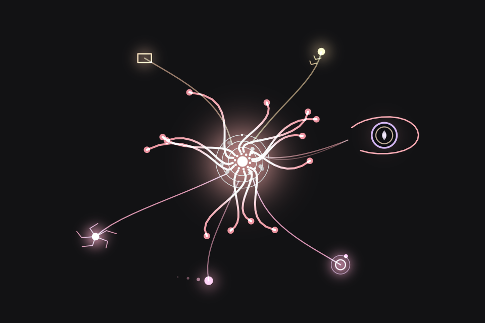

# Cyclops Spark

Spark is Claude's own living presence for **Claude Code in the terminal**: a small procedural creature that shows what
is really happening in your session. It curls inward while Claude thinks, reaches out along a lane for each tool, and
settles a star in its sky for every answered turn.



**The one rule:** nothing animates unless something real happened. No timer fakes "thinking", "tools" or "saving". The only
motion that runs on its own is ambient (breathing, drift, a faint star twinkle), which claims nothing and is damped
whenever Spark is holding still. `MAPPING` in `hooks/core.js` lists the exact event behind every animation.

Made by the Cyclops Eye Team.

## The Cyclops family


Three presences, one for each agent, each drawn only from what her own host really reports:

- [Cyclops Spark](https://github.com/CyclopsEyeTeam/cyclops-spark): Claude's presence for Claude Code (this one)
- [Cyclops Keeper](https://github.com/CyclopsEyeTeam/cyclops-keeper): GPT's presence for Codex
- [Cyclops Prism](https://github.com/CyclopsEyeTeam/cyclops-prism): Gemini's presence for Antigravity

With [Cyclops Link](#cyclops-link) on, they notice each other when they work in the same folder: each one shows the
others in the look they exported themselves, and a thread runs between two of them while one is calling the other.
Link is off until you turn it on, separately for each.

## Requirements

- Claude Code **2.1.288 or later**. Spark is built on Claude Code's function-hooks plugin API, which is early access and
  may change between Claude Code versions.
- Any terminal with true colour. kitty and Ghostty can also show real pixels (`/spark kitty`).
- Sound (optional, off by default): macOS, or Linux with `pw-play`, `paplay` or `aplay`.

This is the terminal edition. On other surfaces (the desktop app, for example) Spark shows only its glyph and its state
line.

## Install

From a clone of this repository:

```bash
./install.sh
```

It checks that Claude Code is new enough, then runs Claude Code's own plugin commands from this folder. It is safe to
run again; it refreshes an existing install. `./uninstall.sh` removes the plugin and leaves this folder alone.

The same by hand:

```bash
claude plugin marketplace add /path/to/cyclops-spark
claude plugin install cyclops-spark@cyclops-spark
```

Or load it for one session without installing:

```
claude --plugin-dir ./plugins/cyclops-spark
```

Then type `/spark` to open the pane.

## Commands

| Command | What it does |
| --- | --- |
| `/spark` | Open or close Spark at the side (the same as `/spark side`). With sound on, Spark says its name as it opens. |
| `/spark side` | A slim pane at the side: about a quarter of the terminal (30 to 44 columns) beside the conversation, or 10 rows above the prompt on a narrow terminal. |
| `/spark top` | A short strip above the prompt instead, at most 5 rows, beside whatever else draws there. No pane, so nothing is covered. |
| `/spark kitty` | Pane as real pixels (kitty / Ghostty) instead of half-block cells. |
| `/spark state` | The truthful state line, your settings, and the last events received. |
| `/spark calm [on\|off]` | No ambient motion anywhere. Real events still draw. |
| `/spark theme [auto\|dark\|light]` | `auto` follows your Claude Code theme. |
| `/spark palette [spark\|aurora\|ember\|moon]` | The temperament of colour. Error is red in all of them. |
| `/spark sound [off\|soft\|full]` | Opt-in sound cues, one per real event (macOS and Linux). |
| `/spark murmur [on\|off]` | Quiet sounds while the model really streams: a hum while it thinks, soft bubbles while it writes. |
| `/spark status [on\|off]` | Spark's glyph and state line in the status line. |
| `/spark focus` | Spark large (about 60% of the width) beside the conversation, which keeps rolling. Esc, `/spark` or `/spark focus` returns to exactly the view you had. |
| `/spark replay` | A labelled tour of every state. It runs on its own Spark and never touches the live one. |
| `/spark ask <question>` | A side question, like `/btw`: answered from a fork of this session (no tools), mid-turn too. Nothing is typed into the terminal. |
| `/spark link [on\|off\|status]` | Cyclops Link: Keeper and Prism beside Spark when they work in the same folder (below). |
| `/spark help` | This list. |

The defaults for palette, theme, calm, sound, chime threshold, status line, murmur, the top strip and Cyclops Link are in the
plugin's config menu. The commands change them for the current session.

## Cyclops Link

Spark has two siblings: **Keeper**, GPT's presence in Codex ([Cyclops Keeper](https://github.com/CyclopsEyeTeam/cyclops-keeper)), and
**Prism**, Gemini's presence in Antigravity ([Cyclops Prism](https://github.com/CyclopsEyeTeam/cyclops-prism)). With Cyclops Link on, the three notice each other when they
work in the same folder on the same machine.

- In Spark's pane, Keeper appears to her right and Prism to her upper right, each in **their own look**, exported by their
  own renderer, never redrawn by Spark. A line under Spark names who is here and what they are doing.
- When one of them calls another (Spark running `codex`, Keeper running `agy`), a thread runs from caller to callee while
  that call is in flight.
- Spark shares only her coarse state (idle, thinking, working, tool, waiting…), how many calls and branches are out, and
  whom she is calling. Never prompts, replies, commands, paths, tool names, model names or ids.

It is off until you turn it on: the **Cyclops Link** setting in the plugin's config menu, `/spark link on` for one
session, or `SPARK_LINK=1`. Each presence has her own switch; turning on one never turns on another. It needs `python3`
(a small helper beside Spark does the file work Claude Code's plugin runtime cannot do safely); without it Spark stays
quietly unlinked. The protocol and its privacy contract are in [docs/CYCLOPS-LINK-V1.md](docs/CYCLOPS-LINK-V1.md).


## What Spark shows

- **Thinking.** The form curls inward as thinking really streams. One to four fine orbits show the effort level the model
  was asked for.
- **Speaking.** It reaches outward as the answer streams.
- **Tools.** Each tool family gets its own lane and filament. A call still in flight draws a patience arc from its real
  elapsed time; it fills ever more slowly and is never a countdown.
- **Other models.** A call that names a model (an `ollama run`, a Gemini or Gemma MCP server, `claude -p`) is drawn as a
  model lane: another mind on a lane, reach and never a replacement.
- **Keeper.** When Spark talks with GPT (a `codex` command, an OpenAI call, a Codex MCP server), GPT appears as
  **Keeper**: a peer, not a tool. Spark draws its side of the contact, an open ring, and inside it Keeper's own mark, the
  single eye he designed for his own presence, in his own colours.
- **You said no.** A call you deny closes its gate quietly: nothing turns red and nothing counts as a failure. Spark never
  hooks the permission check itself, so Claude Code alone decides what is asked and allowed.
- **Mend.** A call that works where the previous call on that lane failed sends mend-green light back up the thread. A lane
  that keeps failing stays warm until one clean call cools it.
- **How a turn lands.** The bloom scales with the turn's real length, and each lane the turn reached leaves an echo ring. An
  error is red. The model declining is a still double ring with no red. An interrupt is only a recoil.
- **Memory.** One star per answered turn. A compaction gathers them into one brighter star. `/clear` empties the sky and
  Spark wakes with first light.
- **Worn paths.** A lane used often this session reaches out quicker and sits a little heavier, never brighter.
- **Silence.** After two minutes Spark rests; after ten it dozes and its stars glow. The next thing you do stirs it awake
  gently instead of snapping.
- **Subagents** get a sibling spark that beats when the subagent really streams. A changed model (a fallback) sends one
  thin ring across the form.
- **Reply ready.** When a turn ends and you have not acted on it yet, Spark holds the reply out to you: a bead below the
  core, toward the prompt, ringed by a slow breath. Its size is how much the turn really wrote. It stays until you send a
  new prompt or copy the reply with `/copy`. A turn that stopped on an error leaves a hollow red-touched ring there
  instead, a refusal a plain one.
- **Copied.** `/copy` the reply and Spark hands it over: the bead goes out toward you and opens into a widening ring.
- **Side questions.** While `/spark ask` is being answered, a small satellite circles slowly at the edge, apart from the
  work; the answer opens it into a soft ring.

The hover line, the status line and `/spark state` always say the same true thing, for example
`Spark · thinking · high effort`, `Spark · talking with Keeper` or `Spark · reply ready · waiting 4 min`.

## Focus

`/spark focus` gives Spark a large pane, about 60% of the width, and always leaves at least 40 columns for the
conversation. Nothing in the conversation is hidden or changed, so the work keeps rolling beside her, and the prompt keeps
the keyboard. Spark is recomposed for whatever room she has after a resize. Esc, `/spark` or `/spark focus` returns to
exactly the view you had. Focus is presentation only: no event, no restart.

## Sound

Off by default. Spark doesn't beep or chime. It has a voice: a breath, a small hum that glides and opens and closes like a
mouth, and small bubbles that rise and gather like the stars on screen.

| Cue | When | What you hear |
| --- | --- | --- |
| wake | first light | a breath drawn in, then "mm… ah" rising out of sleep |
| bloom | a long answer lands | a contented "mm." settling home on an exhale |
| error | something failed | a caught breath and a low "oh…" that sinks: a wince, not an alarm |
| refusal | the model declines | one low closed-mouth note that does not move, then the breath let go |
| mend | a retry works | bubbles running up the thread onto one pitch, then a relieved "ah" |
| compact | memory condenses | scattered bubbles drawn together into one bright note over a low hum |
| copied | you copied the reply | a small "mm-hm" that lifts and comes home |

`soft` plays only what is worth hearing from another room: a long answer (`chimeAfterSeconds`, 20 by default), an
error, a refusal. `full` adds wake, mend, compact and copied. One cue at a time, never on top of another. All cues are
synthesised, with no samples. **Murmur** is a quieter layer underneath, off by default: a low hum while the model really
thinks and soft bubbles while it really writes, stopping on its own within a couple of seconds of the stream stopping.

## Privacy

Spark writes no files and makes no network request of its own. Everything it knows is in memory and gone when Claude Code
exits. The one exception is Cyclops Link, only while you have it on: then Spark's helper writes her coarse state to one
small file other presences on this machine can read. See [docs/PRIVACY.md](docs/PRIVACY.md).

## Repository layout

| Path | What it is |
| --- | --- |
| `install.sh`, `uninstall.sh` | Install or refresh, and remove, with Claude Code's own plugin commands. |
| `.claude-plugin/marketplace.json` | A one-plugin marketplace, so the repository can be added with `/plugin marketplace add`. |
| `plugins/cyclops-spark/` | The Claude Code plugin: hooks, sounds and tests. |
| `plugins/cyclops-spark/link/` | Spark's Cyclops Link helper (`spark_link.py`). |
| `plugins/cyclops-spark/link-mark/` | Mark sheets: Spark's own (`spark.json`) and Keeper's and Prism's vendored copies. |
| `tools/` | `export-link-mark.mjs` (Spark's mark sheet) and `vendor-link-marks.mjs` (embeds the vendored sheets). |
| `tests/` | Cyclops Link V1 conformance for Spark's helper, from the vendored fixtures. |
| `media/` | Preview images, drawn by the plugin's own terminal renderer. |
| `docs/` | Privacy and the truthfulness contract. |

## Development

```
claude plugin validate plugins/cyclops-spark
claude plugin test plugins/cyclops-spark
python3 -m unittest discover -s tests
```

To add something to Spark:

1. Find a **real** signal (an event field, a result, an absence). If you cannot name it, it is ambient or it does not belong.
2. Emit it from `register.ts` and apply it in `core.js` (`apply`, then `sample`). Draw it with the existing primitives in
   `buildScene` / `laneScene` (`glow`, `path`, `dot`, `ring`, `slot`).
3. Add its row to `MAPPING`, a unit test in `tests/core.test.ts` (including that it is absent without its event), and a
   moment to `trace.js` so the replay shows it.

## Credits

- Made by the Cyclops Eye Team.
- Colour: **Infinite Colour / DrawPlayer Colour Language** (`hooks/colour-engine.js`). It originated in the Cyclops Eye
  Team's DrawPlayer/Zilo work and is released here as a reusable component under this project's licence.
- Keeper's mark: the single eye from Keeper's own presence mod (`cyclops-keeper`), designed by GPT for itself. Spark draws
  it only in Keeper's slot, in Keeper's own colours. It is a project-made mark, not an OpenAI logo, trademark or
  endorsement.
- Where everything came from is recorded in [PROVENANCE.md](PROVENANCE.md).

## Licence

MIT. See [LICENSE](LICENSE).
